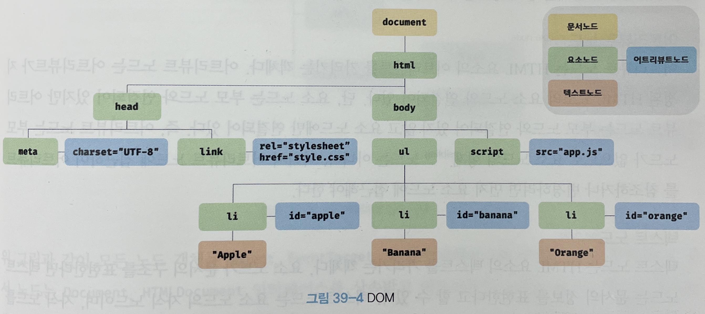
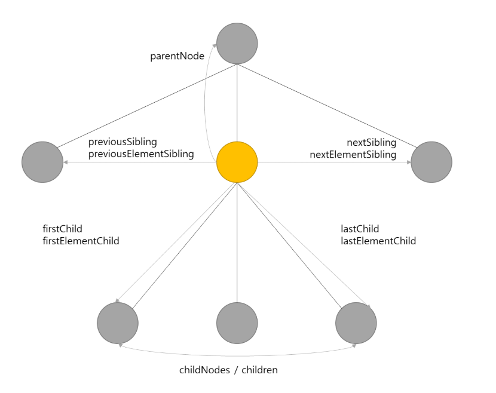

# 모던 자바스크립트 Deep Dive

## 39장 DOM

DOM은 HTML 문서의 계층적 구조와 정보를 표현하며 이를 제어할 수 있는 API, 즉 프로퍼티와 메서드를 제공하는 트리 자료구조이다.

<!-- 월 -->

## 노드

### HTML 요소와 노드 객체

HTML 요소는 HTML 문서를 구성하는 개별적인 요소이다. 렌더링 엔진에 의해 파싱되어 DOM을 구성하는 요소 노도 객체로 변환된다. HTML 요소의 어트리뷰트는 어트리뷰트 노드로, 텍스트 콘텐츠는 텍스트 노드로 변환된다.

HTML 문서는 HTML 요소들의 집합으로 이뤄지며, 중첩 관계를 갖는다.즉, 요소의 시작태그와 종료태그 사이에은 텍스트뿐만 아니라 다른 요소도 포함할 수 있다! 이때 요소 간에는 중접 관계에 의해 부자 관계가 형성된다.
**요소 간의 부자 관계를 반영하여 HTML 요소를 객체화한 모든 노드 객체들을 트리 자료 구조로 구성한다. 노드 객체들로 구성된 트리 자료구조를 DOM이라 한다.**

### 노드 객체의 타입

예를 들어, 다음 HTML 문서를 렌더링 엔진이 파싱한다고 생각해보자.

```html
<!DOCTYPE html>
<html>
  <head>
    <meta charset="UTF-8" />
    <link rel="stylesheet" href="style.css" />
  </head>
  <body>
    <ul>
      <li id="apple">Apple</li>
      <li id="banana">Banana</li>
      <li id="orange">Orange</li>
    </ul>
    <script src="app.js"></script>
  </body>
</html>
```

렌더링 엔진은 위 HTML 문서를 파싱하영 다음과 같이 DOM을 생성한다.


이처럼 DOM은 노드 객체의 계층적인 구조로 구성된다. 노드 객체는 종류가 있고 상속 구조를 갖는다. 노드 객체는 총 12개의 종류가 있는데 중요한 노드 타입은 4가지가 있다.

**문서 노드**

- DOM 트리의 최상위에 존재하는 루트 노드로서 document 객체를 가리킨다.
- DOM 트리의 노드들에 접근하기 위한 진입점 역할을 담당한다. 즉, 요소, 어트리뷰트, 텍스트 노드에 접근하려면 문서 노드를 통해야 한다.

**요소 노드**

- HTML 요소를 가리키는 객체이다.
- HTML 요소 간의 중첩에 의해 부자 관계를 가지며 이 부자 관계를 통해 정보를 구조화한다.

**어트리뷰트 노드**

- HTML 요소의 어트리뷰트를 나타내는 객체다.
- 어트리뷰트가 지정된 HTML 요소의 요소 노드와 연결되어 있다.
- 단, 요소 노드는 부모노드와 연결되어 있지만 어트리뷰트 노드는 부모노드와 연결되어 있지 않고 요소 노드에만 연결되어 있다.
- 어트리뷰트 노드에 접근하여 어트리뷰트를 참조하거나 변경하려면 먼저 요소 노드에 접근해야 한다.

**텍스트 노드**

- HTML 요소의 텍스트를 가리키는 객체다.
- 문서의 정보를 표현 한다고 할 수 있다.
- 요소 노드의 자식이며, 리프노드이다.
- DOM트리의 최종단이다.
- 텍스트 노드에 접근하려면 먼저 부모 노드인 요소 노드에 접근해야 한다.

### 노드 객체의 상속 구조

DOM을 구성하는 노드 객체는 자신의 구조와 정보를 제어할 수 있는 DOM API를 사용할 수 있다. 이를 통해 노드 객체는 자신의 부모, 형제, 자식을 탐색할 수 있으며, 자신의 어트리뷰트와 텍스트를 조작할 수 있다.

## 요소 노드 취득

HTML의 구조나 내용 또는 스타일 등을 동적으로 조작하려면 먼저 요소 노드를 취득해야 한다. 텍스트 노드는 요소 노드의 자식 노드이고, 어트리뷰트 노드는 요소 노드와 연결되어 있기 때문에 텍스토 노드나 어트리뷰트 노드를 조작하고자 할 때도 마찬가지이다.

요소 노드의 취득은 HTML 요소를 조작하는 시작점이다. 이를 위해 DOM은 요소 노드를 취득할 수 있는 다양한 메서드를 제공한다.

### id를 이용한 요소 노드 취득

`Document.prototype.getElementById` 메서드는 인수로 전달한 id 어트리뷰트 값을 갖는 하나의 요소 노드를 탐색하여 반환한다. getElementById 메서드는 Document.prototype의 프로퍼티다. 따라서 반드시 문서 노드인 document를 통해 호출해야 한다.

```html
<!DOCTYPE html>
<html>
  <head>
    <meta charset="UTF-8" />
    <link rel="stylesheet" href="style.css" />
  </head>
  <body>
    <ul>
      <li id="apple">Apple</li>
      <li id="banana">Banana</li>
      <li id="orange">Orange</li>
    </ul>
    <script>
      // id 값이 'banana'인 요소 노드를 탐색하여 반환한다.
      // 두 번째 i 요소가 파싱되어 생성된 요소 노드가 반환된다.
      const $elem1 = document.getElementById("banana");
      const $elem2 = document.getElementById("grape");

      // 취득한 요소 노드의 style.color 프로퍼티 값을 변경한다.
      $elem1.style.color = "red";

      // id 값이 'grape'인 요소 노드를 탐색하여 반환한다. null 반환
      $elem2.style.color = "red";
    </script>
  </body>
</html>
```

- id의 값은 HTML 문서 내에서 유일한 값이어야 하며, class 어트리뷰트와는 달리 공백 문자로 구분하여 여러 개의 값을 가질 수 없다.
- 따라서 HTML 문서 내에 중복된 id 값을 갖는 HTML 요소가 여러 개 존재해도 에러가 발생하지 않는다. 이러한 경우에는 getElementById 메서드는 인수로 전달된 id 값을 갖는 첫번째 요소 노드만 반환한다.

- 만약 인수로 전달된 id 값을 갖는 HTML 요소가 존재하지 않는 경우 null을 반환한다.

### 태그 이름을 이용한 요소 노드 취득

`Document.prototype/Element.prototype.getElementsByTagName` 메서드는 인수로 전달한 태그 이름을 갖는 모든 요소 노드들을 탐색하여 반환한다. getElementsByTagName 메서드는 여러 개의 요소 노드 객체를 갖는 DOM 컬렉션 객체인 HTMLCollection 객체를 반환한다.

```html
<!DOCTYPE html>
<html>
  <body>
    <ul>
      <li id="apple">Apple</li>
      <li id="banana">Banana</li>
      <li id="orange">Orange</li>
    </ul>
    <script>
      // 태그 이름이 li인 요소 노드를 모두 탐색하여 반환한다.
      // 탐색된 요소 노드들은 HTMLCollection 객체에 담겨 반환된다.
      // HTMLCollection 객체는 유사 배열 객체이면서 이터러블이다.
      const $elems = document.getElementsByTagName("li");

      // 취득한 모든 요소 노드의 style.color 프로퍼티 값을 변경한다.
      [...$elems].forEach((elem) => {
        elem.style.color = "red";
      });

      // 모든 요소 노드를 탐색하여 반환
      const $all = document.getElementsByTagName("*");
    </script>
  </body>
</html>
```

- getElementsByTagName 메서드가 반환하는 DOM 컬렉션 객체인 HTMLCollection 객체는 유사 배열 객체이며 이터러블이다.
- HTML 문서의 모든 요소 노드를 취득하려면 getElementsByTagName 메서드의 인수로 '\*'을 전달한다.
- getElementsByTagName 메서드는 Document.prototype에 정의된 메서드와 Element.prototype에 정의된 메서드가 있다.
- Document.prototype에 정의된 메서드는 document로 통해 호출하여 DOM 전체에서 요소 노드를 탐색하여 반환한다.
- Element.prototype에 정의된 메서드는 특정 요소 노드를 통해 호출하며, 특정 요소 노드의 자손 노드 중에서 요소 노드를 탐색하여 반환한다.
- 만약 인수로 전달된 태그 이름을 갖는 요소가 존재하지 않는 경우 빈 객체를 반환한다.

```html
<!DOCTYPE html>
<html>
  <body>
    <ul id="fruits">
      <li>Apple</li>
      <li>Banana</li>
      <li>Orange</li>
    </ul>
    <ul>
      <li>HTML</li>
    </ul>

    <script>
      // DOM 전체에서 태그 이름인 li인 요소 노드를 모두 탐색하여 반환한다.
      const $lisFromDocument = document.getElementsByTagName("li");
      console.log($lisFromDocument);
      // HTMLCollection(4)[li,li,li,li]

      // ul#fruits 요소의 자손 노드 중에서 태그 이름이 li인 요소 노드를 모두 탐색하여 반환한다.
      const $fruits = document.getElementById("fruits");
      const $lisFromFruits = $fruits.getElementsByTagName("li");
      console.log($lisFromFruits);
      // HTMLCollection(3)[li,li,li]
    </script>
  </body>
</html>
```

### class를 이용한 요소 노드 취득

`Document.prototype/Element.prototype.getElementsByClassName` 메서드는 인수로 전달한 class 어트리뷰트 값을 갖는 모든 요소 노드들을 탐색하여 반환한다.
인수로 전달할 class 값은 공백으로 구분하여 여러 개의 class를 지정할 수 있다. getElementsByClassName 메서드는 여러 개의 요소 노드 객체를 갖는 DOM 컬렉션 객체인 HTMLCollection 객체를 반환한다.

```html
<!DOCTYPE html>
<html>
  <body>
    <ul>
      <li class="fruit apple">Apple</li>
      <li class="fruit banana">Banana</li>
      <li class="fruit orange">Orange</li>
    </ul>
    <script>
      const $elems = document.getElementsByClassName("fruit");

      [...$elems].forEach((elem) => {
        elem.style.color = "red";
      });

      const $apples = document.getElementsByClassName("fruit apple");
      [...$apples].forEach((elem) => {
        elem.style.color = "blue";
      });
    </script>
  </body>
</html>
```

- getElementsByTagName 메서드는 Document.prototype에 정의된 메서드와 Element.prototype에 정의된 메서드가 있다.
- Document.prototype에 정의된 메서드는 document로 통해 호출하여 DOM 전체에서 요소 노드를 탐색하여 반환한다.
- Element.prototype에 정의된 메서드는 특정 요소 노드를 통해 호출하며, 특정 요소 노드의 자손 노드 중에서 요소 노드를 탐색하여 반환한다.
- 만약 인수로 전달된 태그 이름을 갖는 요소가 존재하지 않는 경우 빈 객체를 반환한다.

```html
<!DOCTYPE html>
<html>
  <body>
    <ul id="fruits">
      <li class="apple">Apple</li>
      <li class="banana">Banana</li>
      <li class="orange">Orange</li>
    </ul>
    <div class="banana">Banana</div>
    <script>
      // DOM 전체에서 class 값이 'banana'인 요소 노드를 모두 탐색하여 반환
      const $bananasFromDocument = document.getElementsByClassName("banana");
      console.log($bananasFromDocument);
      //HTMLCollection(2) [li.banana, div.banana]

      // #fruits 요소의 자손 노드 중에서 class 값이 'banana'인 요소 노드를 모두 탐색하여 반환
      const $fruits = document.getElementsByClassName("fruits");
      const $bananasFromFruits = $fruits.getElementsByClassName("banana");
      console.log($bananasFromFruits); // HTMLCollection [li.banana]
    </script>
  </body>
</html>
```

### CSS 선택자를 이용한 요소 노드 취득

CSS 선택자는 스타일을 적용하고자 하느 HTML 요소를 특정할 때 사용하는 문법이다. `Document.prototype/Element.prototype.querySelector` 메서드는 인수로 전달한 CSS 선택자를 만족시키는 하나의 요소 노드를 탐색하여 반환한다.

- 인수로 전달한 CSS 선택자를 만족시키는 요소 노드가 여러 개인 경우 첫번째 요소 노드만 반환한다.
- 인수로 전달한 CSS 선택자를 만족시키는 요소 노드가 존재하지 않는 경우 null을 반환한다.
- 인수로 전달한 CSS 선택자가 문법에 맞지 않는 경우 DOMException 에러가 발생한다.

```html
<!DOCTYPE html>
<html>
  <body>
    <ul>
      <li class="apple">Apple</li>
      <li class="banana">Banana</li>
      <li class="orange">Orange</li>
    </ul>
    <script>
      // class 어트리뷰트 값이 'banana'인 첫 번째 요소 노드를 탐색하여 반환한다.
      const $elem = document.querySelector(".banana");

      // 취득한 요소의 프로퍼티 값을 변경
      $elem.style.colore = "red";
    </script>
  </body>
</html>
```

`Document.prototype/Element.prototype.querySelectorAll` 메서드는 인수로 전달한 CSS 선택자를 만족시키는 모든 요소 노드를 탐색하여 반환한다.
querySelectorAll 메서드는 여러 개의 요소 노드 객체를 갖는 DOM 컬렉션 객체인 NodeList 객체를 반환한다. NodeList 객체는 유사 배열 객체이면서 이터러블이다.

- 인수로 전달한 CSS 선택자를 만족시키는 요소가 존재하지 않는 경우 빈 NodeList 객체를 반환한다.
- 인수로 전달한 CSS 선택자가 문법에 맞지 않는 경우 DOMException 에러가 발생한다.

```html
<!DOCTYPE html>
<html>
  <body>
    <ul>
      <li class="apple">Apple</li>
      <li class="banana">Banana</li>
      <li class="orange">Orange</li>
    </ul>
    <script>
      // ul 요소의 자식 요소인 li 요소를 모두 탐색하여 반환
      const $elems = document.querySelectorAll("ul > li");
      console.log($elems); // NodeList(3) [li.apple, li.banana, li.orange]

      // 취득한 모든 요소 노드의 프로퍼티 값 변경
      $elems.forEach((elem) => {
        elem.style.color = "red";
      });

      const $all = document.querySelectorAll("*");
      console.log($all);

      // NodeList(8) [html, head, body, ul, li#apple, li#banana, li#orange, script]
    </script>
  </body>
</html>
```

CSS 선택자 문법을 사용하는 querySelector, querySelectorAll 메서드는 getElementById, getElementBy\*\*\* 메서드보다 다소 느리지만 CSS 선택자 문법을 사용하여 좀 더 구체적인 조건으로 요소 노드를 취득할 수 있고 일관된 방식으로 요소 노드를 취득할 수 있는 장점이 있다.

따라서 id어트리뷰트가 있는 요소 노드를 취득할 때는 getElementById 메서드, 그 외에는 querySelector, querySelectorAll 메서드를 사용하는 것을 권장한다.

### 특정 요소 노드를 취득할 수 있는지 확인

`Element.prototype.mathces` 메서드는 인수로 전달한 CSS 선택자를 통해 특정 요소 노드를 취득할 수 있는지 확인한다.

```html
<!DOCTYPE html>
<html>
  <body>
    <ul id="fruits">
      <li class="apple">Apple</li>
      <li class="banana">Banana</li>
      <li class="orange">Orange</li>
    </ul>
    <script>
      const $apple = document.qeurySelector(".apple");

      console.log($apple.matches("#fruits > li.apple")); // true

      console.log($apple.matches("#fruits > li.banana")); // false
    </script>
  </body>
</html>
```

### HTMLCollection과 NodeList

HTMLCollection과 NodeList는 DOM API가 여러 개의 결과값을 반환하기 위한 DOM 컬렉션 객체다.

- 유사 배열 객체이다.
- for...of문으로 순회할 수 있으며 스프레드 문법을 사용하여 간단히 배열로 변환할 수 있다.
- 중요한 특징은 노드 객체의 상태 변화를 실시간으로 반영하는 **살아 있는 객체**이다.
- HTMLCollection은 언제나 live 객체지만 NodeList는 대부분의 경우 노드 객체의 상태 변화를 실시간으로 반영하지 않고 과거의 정적 상태를 유지하는 non-live 객체로 동작하지만 경우에 따라 live 객체로 동작할 때가 있다.

#### HTMLCollection

```html
<!DOCTYPE html>
<head>
  <style>
    .red {
      color: red;
    }
    .blue {
      color: blue;
    }
  </style>
</head>
<html>
  <body>
    <ul id="fruits">
      <li class="apple">Apple</li>
      <li class="banana">Banana</li>
      <li class="orange">Orange</li>
    </ul>
    <script>
      const $elems = document.getElementsByClassName("red");

      console.log($elems); // HTMLCollection(3) [li.red, li.red, li.red]

      for (let i = 0; i < $elems.length; i++) {
        $elems[i].className = "blue";
      }

      console.log($elems); // HTMLCollection(1) [li.red]
    </script>
  </body>
</html>
```

위의 예제는 class값이 red인 요소 노드를 모두 취득하고, 취득된 요소 노드를 담고 있는 HTMLCollection을 for문으로 순회하여 red에서 blue로 변경한다.

따라서 위 예제가 정상적으로 실행되면 전체가 blue로 변경되서 파란색으로 렌더링될 것이다. 그런데 예상대로 동작하지 않는다. 그 이유를 알아보자

1. 첫 번째 반복(i=0)

- $elems[0]은 첫 번째 li요소이다. className에 의해 red에서 blue로 변경되고 변경되었으므로 getElementByClassName 메서드의 인자로 전달한 red와는 일치하지 않기 때문에 실시간으로 제거된다.

2. 두 번째 반복(i=1)

- 첫 번째 반복에서 첫 번째 li요소는 제거되었으므로 $elems[1]은 세 번째 li요소가 된다. 따라서 세 번째 li요소의 class값이 red에서 blue로 변경되고 $elem에서 실시간으로 제거된다.

3. 세 번째 반복(i=2)

- 첫 번째, 두 번째 반복에서 첫 번째, 세 번째 li 요소가 $elem에서 제거되었다. 따라서 $elem에는 두 번째 li요소 노드만 남았다. 이때 $elems.length는 1이므로 for문의 조건식에서 false로 평가되어 반복이 종료된다. 따라서 두 번째 li 요소의 class값은 변경되지 않는다.

이처럼 HTMLCollection 객체는 실시간으로 노드 객체의 상태 변경을 반영하여 요소를 제거할 수 있기 때문에 for문으로 순회하면서 노드 객체의 상태를 변경해야 할 때 주의해야 한다.

이 문제는 for문을 역방향으로 순회하는 방법으로 회피할 수 있다. 또는 while문을 사용하여 객체에 노드 객체가 남아 있지 않을 때까지 무한 반복하는 방법도 있다.

```jsx
for (let i = $elems.length - 1; i >= 0; i--) {
  $elems[i].className = "blue";
}

let i = 0;
while ($elems.length > i) {
  $elems[i].className = "blue";
}
```

더 간단한 해결책은 부작용을 발생시키는 원인인 HTMLCollection 객체를 사용하지 않는 것이다. 유사 배열 객체이면서 이터러블인 HTMLCollection 객체를 배열로 변환하면 부작용을 발생시키는 HTMLCollection 객체를 사용할 필요가 없고 유용한 배열의 고차함수를 사용할 수 있다!

```jsx
[...$elems].forEach((elem) => (elem.className = "blue"));
```

#### NodeList

HTMLCollection 객체의 부작용을 해결하기 위해 querySelectorAll메서드를 사용하는 방법도 있다.

```jsx
const $elems = document.querySelectorAll("red");

// NodeList 객체는 NodeList.prototype.forEach 메서드를 상속받아 사용할 수 있다.
$elems.forEach((elem) => (elem.className = "blue"));
```

NodeList.prototype.forEach 메서드는 Array.prototype.forEach 메서드와 사용방법이 동일하다.

NodeList 객체는 과거의 정적 상태를 유지하는 non-live 객체로 동작한다. 하지만 **childNodes 프로퍼티가 반환하는 NodeList 객체는 HTMLCollection 객체와 같이 실시간으로 노드 객체의 상태 변경을 반영하는 live 객체로 동작하므로 주의해야 한다.**

따라서 **노드 객체의 상태 변경과 상관없이 안전하게 DOM 컬렉션을 사용하려면 HTMLCollection이나 NodeList객체를 배열로 변환하여 사용하는 것을 권장한다!**

HTMLCollection과 NodeList 객체가 메서드를 제공하기는 하지만 배열의 고차 함수 만큼 다양한 기능을 제공하지 않으므로 배열로 변환하면 유용한 고차 함수를 사용할 수 있다는 장점이 있다. 두 객체는 둘다 유사 배열 객체면서 이터러블이여서 스프레드 문법이나 Array.from 메서드를 사용하여 간단하게 배열로 변환할 수 있다.

## 노드 탐색

요소 노드를 취득한 다음, 취득한 요소 노드를 기점으로 DOM 트리의 노드를 옮겨 다니며 부모, 형제, 자식 노드 등을 탐색해야 할 때가 있다.

```html
<ul id="fruits">
  <li class="apple">Apple</li>
  <li class="banana">Banana</li>
  <li class="orange">Orange</li>
</ul>
```

ul#fruits 요소는 3개의 자식요소를 갖는다. 이때 먼저 ul#fruits 요소 노드를 취득한 다음, 자식 노드를 모두 탐색하거나 자식 노드 중 하나만 탐색할 수 있다. li.banana는 2개의 형제요소와 부모요소를 갖는다. 이때 먼저 li.banana 요소 노드를 취득한 다음, 형제 노드를 탐색하거나 부모 노드를 탐색할 수 있다.

이처럼 DOM 트리 상의 노드를 탐색할 수 있도록 Node, Element 인터페이스는 트리 탐색 프로퍼티를 제공한다.


노드 탐색 프로퍼티는 모두 접근자 프로퍼티다. 단, 노드 탐색 프로퍼티는 setter없이 getter만 존재하여 참조만 가능한 읽기 전용 접근자 프로퍼티다. 따라서 읽기 전용 접근자 프로퍼티에 값을 할당하면 아무런 에러 없이 무시된다.

### 공백 텍스트 노드

지금까지 언급하지 않았지만 HTML 요소 사이의 스페이스, 탭, 줄바꿈 등의 공백문자는 텍스트 노드를 생성한다. 이를 공백 텍스트 노드라고 한다.

```html
<!DOCTYPE html>
<html>
  <body>
    <ul id="fruits">
      <li class="apple">Apple</li>
      <li class="banana">Banana</li>
      <li class="orange">Orange</li>
    </ul>
  </body>
</html>

<!--  인위적으로 공백문자를 제거 -->
<ul id="fruits">
  <li class="apple">Apple</li>
  <li class="banana">Banana</li>
  <li class="orange">Orange</li>
</ul>

<!-- 하지만 가독성이 좋지 않으므로 권장하지 않음 -->
```

### 자식 노드 탐색

자식 노드를 탐색하기 위해서는 다음과 같은 노드 탐색 프로퍼티를 사용한다.
|프로퍼티|설명|
|---|---|
|Node.prototype.childNodes|자식 노드를 모두 탐색하여 NodeList에 담아 반환하며 요소 노드 뿐만아니라 텍스트 노드도 포함되어 있을 수 있다.|
|Element.prototype.children|자식 노드 중에서 요소 노드만 모두 탐색하여 HTMLCollection에 담아 반환하며 텍스트 노드가 포함되지 않는다.|
|Node.prototype.firstChild|첫 번째 자식 노드를 반환한다. firstChild 프로퍼티가 반환한 노드는 텍스트 노드이거나 요소 노드이다.|
|Node.prototype.lastChild|마지막 자식 노드를 반환한다. lastChild 프로퍼티가 반환한 노드는 텍스트 노드이거나 요소 노드이다.|
|Element.prototype.firstElementChild|첫 번째 자식 요소 노드를 반환한다. firstElementChild 프로퍼티는 요소 노드만 반환한다.|
|Element.prototype.lastElementChild|마지막 자식 요소 노드를 반환한다. lastElementChild 프로퍼티는 요소 노드만 반환한다.|

```html
<!DOCTYPE html>
<html>
  <body>
    <ul id="fruits">
      <li class="apple">Apple</li>
      <li class="banana">Banana</li>
      <li class="orange">Orange</li>
    </ul>
  </body>
  <script>
    // 노드 탐색의 기점이 되는 #fruits 요소 노드 취득
    const $fruits = document.getElementById("fruits");

    // #fruits 요소의 모든 자식 노드를 탐색, NodeList에 요소노드 뿐만아니라 텍스트 노드도 포함
    console.log($fruits.childNodes);
    //NodeList(7)[text, li.apple, text, li.banana, text, li.orange, text]

    // #fruits 요소의 모든 자식 노드를 탐색, HTMLCollection에는 요소 노드만 포함
    console.log($fruits.children);
    // HTMLCollection(3) [li.apple, li.banana, li.orange]

    // #fruits 요소의 첫 번째 자식 노드 탐색, 텍스트 노드를 반환할 수 있음
    console.log($fruits.firstChild); // #text

    // #fruits 요소의 마지막 자식 노드 탐색, 텍스트 노드를 반환할 수 있음
    console.log($fruits.lastChild); // #text

    // #fruits 요소의 첫번째 자식 노드를 탐색, 요소 노드만 반환
    console.log($fruits.firstElementChild); // li.apple
    // #fruits 요소의 마지막 자식 노드를 탐색, 요소 노드만 반환
    console.log($fruits.lastElementChild); // li.orange
  </script>
</html>
```

### 자식 노드 존재 확인

자식 노드가 존재하는지 확인하려면 `Node.prototype.hasChildNodes` 메서드를 사용한다.
자식 노드가 존재하면 true, 존재하지 않으면 false를 반환하며, 텍스트 노드를 포함하여 자식 노드의 존재를 확인한다.

```html
<!DOCTYPE html>
<html>
  <body>
    <ul id="fruits"></ul>
  </body>
  <script>
    const $fruits = document.getElementById("fruits");

    console.log($fruits.hasChildNodes()); // true
  </script>
</html>
```

자식 노드 중에 텍스트 노드가 아닌 요소 노드가 존재하는지는 확인하려면 hasChildNodes 메서드 대신 children.length 또는 Element 인터페이스의 childElementCount 프로퍼티를 사용한다.

```html
<!DOCTYPE html>
<html>
  <body>
    <ul id="fruits"></ul>
  </body>
  <script>
    const $fruits = document.getElementById("fruits");

    console.log(!!$fruits.chileren.length); // 0->false
    console.log(!!$fruits.chilElementCount); // 0->false
  </script>
</html>
```

### 요소 노드의 텍스트 노드 탐색

요소 노드의 텍스트 노드는 요소 노드의 자식 노드다. 따라서 요소 노드의 텍스트 노드는 firstChild 프로퍼티로 접근할 수 있다. firstChild 프로퍼티가 반환한 노드는 텍스트 노드이거나 요소 노드다.

```html
<!DOCTYPE html>
<html>
  <body>
    <ul id="foo">
      hello
    </ul>
  </body>
  <script>
    console.log(document.getElementBtId("foo").firstChild); // #text
  </script>
</html>
```

### 부모 노드 탐색

부모 노드를 탐색하려면 Node.prototype.parentNode 프로퍼티를 사용한다. 텍스트 노드는 DOM트리의 최종단 노드인 리프 노드이므로 부모노드가 텍스트 노드인 경우는 없다!

```html
<!DOCTYPE html>
<html>
  <body>
    <ul id="fruits">
      <li class="apple">Apple</li>
      <li class="banana">Banana</li>
      <li class="orange">Orange</li>
    </ul>
  </body>
  <script>
    const $banana = document.querySelector(".banana");

    console.log($banana.parentNode); // ul#fruits
  </script>
</html>
```

### 형제 노드 탐색

부모 노드가 같은 형제 노드를 탐색하려면 다음과 같은 노드 탐색 프로퍼티를 사용한다.
|프로퍼티|설명|
|---|---|
|Node.prototype.previousSibling|부모 노드가 같은 형제 노드 중에서 자신의 이전 형제 노드를 탐색하여 반환한다. 요소 노드뿐만 아니라 텍스트 노드도 반환할 수 있다.|
|Node.prototype.nextSibling|부모 노드가 같은 형제 노드 중에서 자신의 다음 형제 노드를 탐색하여 반환한다. 요소 노드뿐만 아니라 텍스트 노드도 반환할 수 있다.|
|Element.prototype.previousElementSibling|부모 노드가 같은 형제 노드 중에서 자신의 이전 형제 노드를 탐색하여 반환한다. 요소 노드만 반환한다.|
|Element.prototype.nextElementSibling|부모 노드가 같은 형제 노드 중에서 자신의 다음 형제 노드를 탐색하여 반환한다. 요소 노드만 반환한다.|

```html
<!DOCTYPE html>
<html>
  <body>
    <ul id="fruits">
      <li class="apple">Apple</li>
      <li class="banana">Banana</li>
      <li class="orange">Orange</li>
    </ul>
  </body>
  <script>
    const $fruits = document.getElementById("fruits");
  </script>
</html>
<!-- 응응???????????? -->
```

## 노드 정보 취득

노드 객체에 대한 정보를 취득하려면 다음과 같은 노드 정보 프로퍼티를 사용한다.

`Node.prototype.nodeType`은 노드 객체의 종류, 즉 노드 타입을 나타내는 상수를 반환한다.

- Node.ELEMENT_NODE: 요소 노드 타입을 나타내는 상수 1 반환
- Node.TEXT_NODE: 텍스트 노드 타입을 나타내는 상수 3 반환
- Node.DOCUMENT_NODE: 문서 노드 타입을 나타내는 상수 9 반환

`Node.prototype.nodeName` 은 노드의 이름을 문자열로 반환한다.

- 요소 노드 : 대문자 문자열로 태그이름을 반환
- 텍스트 노드 : 문자열 `'#text'`를 반환
- 문서 노드 : 문자열 `'#document'`를 반환

```html
<!DOCTYPE html>
<html>
  <body>
    <ul id="foo">
      Hello
    </ul>
  </body>
  <script>
    console.log(document.nodeType); // 9
    console.log(document.nodeName); // #document

    const $foo = document.getElementById("foo");
    console.log($foo.nodeType); // 1
    console.log($foo.nodeName); // DIV

    const $textNode = $foo.firstChild;
    console.log($textNode.nodeType); // 3
    console.log($textNode.nodeName); // #text
  </script>
</html>
```

## 요소 노드의 텍스트 조작

### nodeValue

지금까지 살펴본 프로퍼티는 모두 읽기 전용이다. Node.prototype.nodeValue 프로퍼티는 setter와 getter 모두 존재하는 접근자 프로퍼티이다.

노드 객체의 nodeValue 프로퍼티를 참조하면 노드 객체의 값을 반환한다. 노드 객체의 값이란 텍스트 노드의 텍스트다. 따라서 문서 노드나, 요소 노도의 nodeValue 프로퍼티를 참조하면 null을 반환한다.

```html
<!DOCTYPE html>
<html>
  <body>
    <ul id="foo">
      Hello
    </ul>
  </body>
  <script>
    console.log(document.nodeValue); // null

    const $foo = document.getElementById("foo");
    console.log($foo.nodeValue); // null

    const $textNode = $foo.firstChild;
    console.log($textNode.nodeValue); // Hello
  </script>
</html>
```

텍스트 노드의 nodeValue 프로퍼티에 값을 할당하면 텍스트를 변경할 수 있다.

1. 텍스트를 변경할 요소 노드를 취득한 다음, 취득한 요소 노드의 텍스트 노드를 탐색한다.
2. 탐색한 텍스트 노드의 nodeValue 프로퍼티를 사용하여 텍스트 노드의 값을 변경한다.

```html
<!DOCTYPE html>
<html>
  <body>
    <ul id="foo">
      Hello
    </ul>
  </body>
  <script>
    const $foo = document.getElementById("foo");
    const $textNode = $foo.firstChild;

    $textNode.nodeValue = "World";
    console.log($textNode.nodeValue); // World
  </script>
</html>
```

### textContent

Node.prototype.textContent 프로퍼티는 setter와 getter 모두 존재하는 접근자 프로퍼티로서 요소 노드의 텍스트와 모든 자손 노드의 텍스트를 모두 취득하거나 변경한다.

```html
<!DOCTYPE html>
<html>
  <body>
    <div id="foo">Hello <span>world!</span></div>
  </body>
  <script>
    console.log(document.getElementById("foo").textContent); // Hello world!
  </script>
</html>
```
