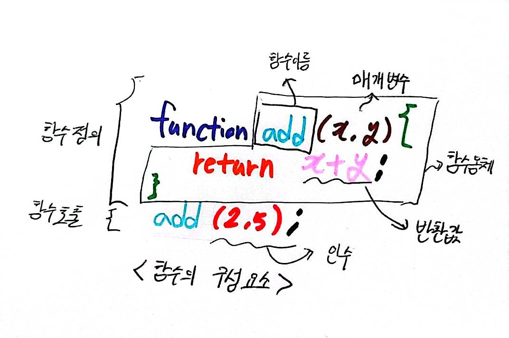
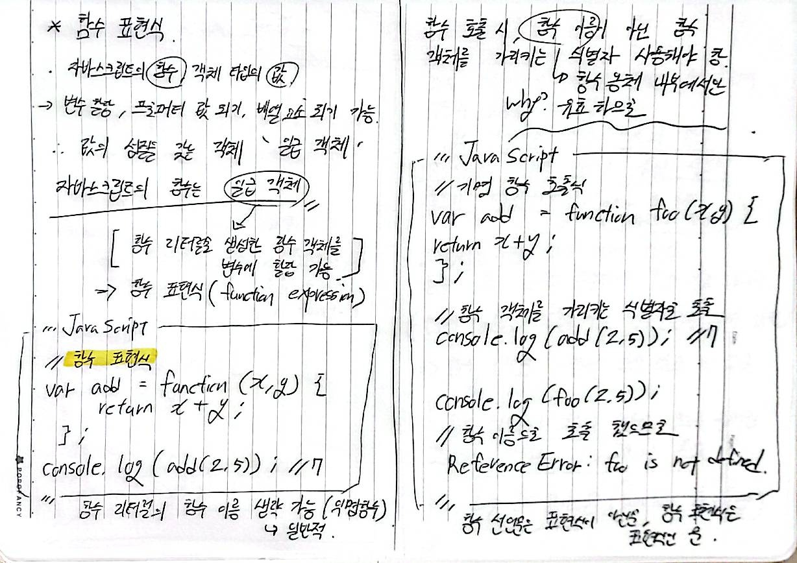
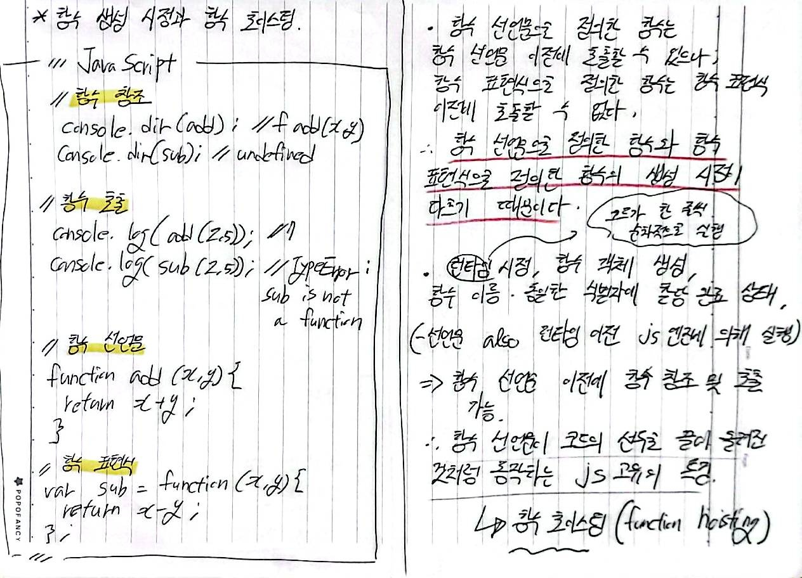

# 12. 함수

### 함수란 ?

- 프로그래밍 언어의 함수는 **일련의 과정을 문으로 구현하고 코드 블록으로 감싸 하나의 실행 단위로 정의** 한 것

이 함수도 수학적 함수처럼 입력을 받아 출력을 내보내는데, 함수 내부로 입력을 전달받는 변수를 `매개변수 (parameter)`, 입력을 `인수 (argument)` , 출력을 `반환값(return value)`이라 한다.

또한 함수는 값이며 , 여러 개 존재할 수 있으며 특정 함수를 구별하기 위해 식별자인 함수 이름을 사용할 수 있다.

함수는 함수 정의 (function definition)를 통해 생성한다.

다음은 함수 선언문을 통해 함수를 정의 한 예다.

```JavaScript
//함수 정의
function add(x,y) {
    return x + y;
}
```

<br>

함수 정의 만으로 함수가 실행 되지는 않는다. 인수(argument)를 매개변수를 통해 함수에 전달하며 함수의 실행을 명시적으로 지시하는 **함수 호출 ( function call/ invoke )** 이 필요하다.

```JavaScript
//함수 호출
var result = add(2,5);

//함수 add에 인수 2,5를 전달하면서 호출하면 반환값 7을 반환한다.
console.log(result); //7
```

<br>

---

### 함수 리터럴

- 자바스크립트에서 함수는 **객체 타입** 의 값인데, 따라서 함수도 함수 리터럴로 생성 할 수 있다. 함수 리터럴은 `function 키워드` , `함수 이름`, `매개 변수 목록` , `함수 몸체`로 구성된다.

<br>
<p align="center">


<br>

```JavaScript
//변수에 함수 리터럴을 할당
var f = function add(x,y) {
    return x + y ;
};
```

함수 리터럴의 구성 요소는 다음과 같다.

```
1. 함수 이름

 - 함수 이름은 식별자 - 네이밍 규칙 준수 해야함

 - 함수 이름은 함수 몸체 내에서만 참조할 수 있는 식별자

 - 함수 이름은 생략 가능
```

```
2. 매개변수 목록

- 0 개 이상의 매배견수를 소괄호로 감싸고 쉼표로 구분

- 각 매개변수에는 함수를 호출할 때 지정한 인수가 순서대로 할당. 즉, 매개변수 목록은 순서에 의미가 있음

- 매개변수는 함수 몸체 내에서 변수와 동일하게 취급. 매개변수도 식별자 네이밍 규칙 준수 해야
```

```
3. 함수 몸체

- 함수가 호출 되었을 때 일괄적으로 실행될 문들을 하나의 실행 단위로 정의한 코드 블록

- 함수 호출에 의해 실행
```

함수는 객체지만 일반 객체와는 다르다. **일반 객체는 호출할 수 없으나 함수는 호출 가능하다.**

---

### 함수 정의

#### 1. 함수 선언문

함수 선언문을 사용해 함수를 선언하는 방식은 다음과 같다.

<br>

```JavaScript
//함수 선언문
fuction add(x,y) {
    return x + y ;
}

// 함수 참조
//console.dir 은 console.log와는 달리 함수 객체의 프로퍼티 까지 출력한다.
//단, Node.js 환경에서는 console.log와 같은 결과가 출력된다.
console.dir(add); // f add (x,y)

//함수 호출
console.log(add(2,5)); //7
```

함수 선언문은 함수 리터럴과 형태가 동일하다. 단, 함수 리터럴은 함수 이름을 생략할 수 있으나 **함수 선언문은 함수 이름을 생략할 수 없다.**

**함수 선언문은 표현식이 아닌 문이다.** 따라서 크롬 개발자 도구의 콘솔에서 함수 선언문을 실행한다면 완료 값 undefined 가 출력될 것이다.

앞서 5.6 절에서 살펴 보았듯이, 표현식이 아닌 문은 변수에 할당할 수 없다.

```JavaScript
///함수 선언문은 표현식이 아닌 문이므로 변수에 할당할 수 없다.
//하지만 함수 선언문이 변수에 할당 되는 것처럼 보인다.
var add = function add(x,y) {
    return x+y ;

};

//함수 호출
console.log (add(2,5)); //7
```

자바스크립트에서 함수 선언문과 함수 리터럴 표현식은 형태가 비슷해 보이지만 코드가 작성된 문맥에 따라 다르게 해석된다.

가장 큰 차이점은 함수 선언문은 그 자체가 하나의 문장이며 호이스팅되어 함수가 코드의 최상단에서 생성된다. 반면에 함수 리터럴은 값으로 취급되어 변수에 할당되거나 함수의 인수로 전달될 수 있다.

예를 들어서 `function foo()` `{}`는 단독으로 사용될 때 함수 선언문으로 해석되지만 `const bar = function foo()` `{}`처럼 변수에 할당될 때는 함수 리터럴 표현식으로 해석된다. 이는 자바스크립트 엔진이 `{}`가 블록인지 객체 리터럴인지 문맥으로 판단하는 것과 유사하다.

```JavaScript
//기명 함수 리터럴을 단독으로 사용하면 함수 선언문으로 해석된다.
// 함수 선언문에서는 함수 이름을 생략할 수 없다.
function foo() { console.log('foo');}
foo(); //foo

//함수 리터럴을 피연산자로 사용하면 함수 선언문이 아니라 함수 리터럴 표현식으로 해석된다.
//함수 리터럴에서는 함수 이름을 생략할 수 있다.
(function bar() {console.log('bar';)});
bar(); //ReFerenceError: bar is not defined
```

함수 선언문과 함수 리터럴 표현식은 코드의 문맥에 따라 다르게 해석된다.

함수 선언문: 단독으로 사용될 때 엔진은 이를 함수 선언문으로 간주하고, 함수 이름과 동일한 식별자를 암묵적으로 생성해 함수 객체를 할당한다. 이 식별자 덕분에 `foo()`처럼 함수를 호출할 수 있다.

함수 리터럴 표현식: 변수 할당이나 그룹 연산자 `()` 내부처럼 표현식이 와야 할 문맥에 사용된다. 이 경우 함수 이름은 함수 몸체 안에서만 유효하며 외부에서는 해당 함수 이름으로 호출할 수 없다. `const bar = function()` `{}`와 같이 변수에 할당해야만 `bar()`로 호출할 수 있다.

지금까지의 함수 선언문을 의사 코드로 표현하면 다음과 같다.

```JavaScript
var add = funcion add(x , y) {
    return x + y ;
};

console.log (add(2,5)); //7
```

함수는 함수 이름으로 호출하는 것이 아닌, 함수 객체를 가리키는 식별자로 호출함을 기억하자.

---

#### 함수 표현식

<br>

<p align="center">


---

#### 함수 생성 시점과 함수 호이스팅

   <br>

<p align="center">


---

#### Function 생성자 함수

<br>

```JavaScript
var add = new Function ('x' ,'y' 'return x + y');
console.log(add(2,5)); //7
```

js에서 함수를 만드는 일반적인 방법 - 함수 선언문 / 함수 표현식 사용

-> new function 사용 시, 함수의 매개변수 이름( `'x'` , `'y'`) 과 함수의 몸체(`'var add = new Function ('x','y', 'return x + y');`)를 문자열로 전달해서 동적으로 함수 생성 가능

위 예시코드는 아래와 같은 함수 선언문과 동일한 역할을 함.

```JavaScript
function add(x, y) {
    return x + y;
}
```

**_일반적인 함수 생성 방법보다 느려서 특수 상황이 아니면 잘 사용되지 않음_**

---

#### 화살표 함수

<br>

화살표 함수는 function 키워드 대신 화살표 `=>` 를 사용해 좀 더 간략한 방법으로 함수 선언 가능. ( 항상 익명 함수로 정의)

```JavaScript
const add = (x ,y) => x + y;
console.log(add(2,5)); //7
```

---

### 함수 호출

#### 매개변수와 인수

<br>

함수를 실행하기 위해 필요한 값을 함수 외부에서 내부로 전달할 필요가 있는 경우에는,

매개변수를 통해 인수를 전달한다.

인수는 **값으로 평가될 수 있는 표현식이어야** 한다. 또한 그 개수와 타입에 제한이 없다.

```JavaScript
//함수 선언문
function add(x,y) {
    return x + y;
}

//함수 호출
//인수 1과 2가 매개변수 x와 y에 순서대로 할당되고 함수 몸체의 문들이 실행된다.
var result = add(1,2);
```

매개변수는 함수 몸체 내부에서 변수와 동일하게 취급되며, 함수 호출 시 함수 몸체 내에서 암묵적으로 매개변수가 생성되고 undefined로 초기회된 이후 인수가 순서대로 할당된다.

(add가 실행되기 전에, js엔진은 이 함수의 x,y를 위한 공간을 메모리에 자동으로 만드는데, 이때 변수들에는 일단 undefined가 할당됨. 이후 함수 호출시 전달한 인수 1,2가 변수들에 할당. )

```JavaScript
function add(x,y){
    console.log(x,y);// 2 5
    return x + y;

}

add(2,5);

// add함수의 매개변수 x,y는 함수 몸체 내부에서만 참조할 수 있다.
console.log(x,y); //ReferenceError: x is not defined
```

위 예제에서 볼 수 있다시피, 매개변수는 함수 몸체 내부에서만 참조할 수 있고, 함수 몸체 외부에서는 참조할 수 없다.

```JavaScript
function add(x,y){
    return x + y ;

}

console.log(add(2)); //NaN
```

위 예제에서 필요한 인수는 두개인데 하나만 할당되었다. 따라서 매개변수 y는 undefined로 초기화된 상태 그대로다. 따라서 함수 몸체의 문 x + y 는 2 + undefined 와 같으므로 NaN이 반환된다.

만일, 매개변수보다 인수가 더많은 경우 초과된 인수는 무시된다.
(그냥 버려지는 것은 아니고, 암묵적으로 argument 객체의 프로퍼티로 보관된다.)

---

#### 인수 확인

```JavaScript
function add(x,y) {
    return x + y;
}
```

위 함수를 정의한 개발자의 의도는 아마 2개의 숫자 타입 인수를 전달받아 그 합계를 반환하려는 것으로 추측된다. 그러나 **어떤 타입의 인수를 전달해야 하는지,** **어떤 타입의 값을 반환하는지** 명확하지 않다.

```JavaScript
function add(x,y) {
    return x + y ;
}

console.log(add(2)); //NaN
console.log(add('a','b')); //'ab'
```

위 코드는 아무런 문제가 없으므로 js 엔진은 위 코드를 실행할 것이다.

그 이유는,

1. 자바스크립트 함수는 매개변수와 인수의 개수가 일치하는지 확인하지 않는다.

2. 자바스크립트는 동적 타입 언어다. 따라서 자바스크립트 함수는 매개변수의 타입을 사전에 지정할 수 없다.

그렇게 때문에 자바스크립트의 경우 함수를 정의할 때 적절한 인수가 전달되었는지 확인할 필요가 있다.

```JavaScript
function add(x,y) {
    if (typeof x !== 'number' || typeof y !== 'number'){
        //매개변수를 통해 전달된 인수의 타입이 부적절한 경우 에러를 발생시킨다.
    throw new TypeError('인수는 모두 숫자 값이어야 합니다.');
    }

return x + y ;

}

console.log(add(2)); //TypeError : 인수는 모두 숫자 값이어야 합니다.
console.log(add('a','b')); //TypeError : 인수는 모두 숫자 값이어야 합니다.
```

이렇게 코드를 구현하더라도 부적절한 호출을 사전에 방지할 수는 없고 에러는 런타임에 발생하게 된다.

**타입스크립트와 같은 정적 타입을 선언할 수 있는 자바스크립트의 상위 확장을 도입하여 컴파일 시점에 부적절한 호출을 방지 할 수 있게 하는 것도 하나의 방법이다.**

( 타입스크립트와 같은 정적 타입 언어는 변수의 타입을 미리 지정해야 하기 때문이다.)

---

#### 매개변수의 최대 개수

매개변수가 많아지면 유지보수성이 나빠진다.

따라서 함수의 매개변수는 코드를 이해하는 데 방해되는 요소이므로 이상적인 매개변수의 개수는 0개이다. 적을수록 좋다.

매개변수는 최대 3개 이상을 넘지 않는 것을 권장하며, 만약 그 이상의 매개변수가 필요할 경우에는 하나의 매개변수를 선언 후 객체를 인수로 전달하는 것이 유리하다.

---

#### 반환문

함수는 return 키워드와 표현식 (반환값) 으로 이루어진 반환문을 사용해서 결과를 함수 외부로 반환(return)할 수 있다.

```JavaScript
function multiply (x,y){
    return x * y; //반환문
}
// 함수 호출은 반환값으로 평가된다.
var result = multiply(3,5);
console.log(result); //15
```

위 예제에서 multiply 함수는 두 개의 인수를 전달받아 곱한 결과값을 return 키워드를 사용해 반환한다.

함수는 return 키워드를 사용해 자바스크립트에서 사용 가능한 모든 값을 반환할 수 있다.

함수 호출은 표현식인데, 함수 호출 표현식은 return 키워드가 반환한 표현식의 평가 결과인 반환값으로 평가된다.

----

### 참조에 의한 전달과 외부 상태의 변경

앞서 살펴 보았듯이, 원시 값은 값에 의한 전달, 객체는 참조에 의한 전달 방식으로 동작한다.

**매개변수도 값에 의한 전달, 참조에 의한 전달 방식을 그대로 따른다.**

```JavaScript
//매개변수 primitive는 원시 값을 전달받고, 매개변수 obj는 객체를 전달받는다.
function changeVal(primitive, obj) {
    primitive += 100;
    obj.name = 'kim';
}

//외부 상태
var num = 100;
var person = { name : 'Lee' }

console.log(num); //100
console.log(person); // {name: "lee"}

//원시 값은 값 자체가 복사되어 전달되고 객체는 참조 값이 복사되어 전달된다.
changeVal (num,person);


//원시 값은 원본이 훼손되지 않는다.
console.log(num); //100

//객체는 원본이 훼손된다.
console.log(person); //{name: "Kim"}
```

changeVal 함수는 매개변수를 통해 전달받은 원시 타입 인수와 객체 타입 인수를 함수 몸체에서 변경한다.

엄밀히 말하면, 원시 타입 인수를 전달받은 매개변수 `primitive`의 경우, 원시 값은 변경 불가능 하므로 재할당을 통해 새로운 원시 값이 되었고, 객체 타입 인수를 전달받은 매개 변수 obj의 경우, 객체는 변경 가능하므로 재할당 없이 직접 할당된 객체를 변경했다.

***이때 원시 타입 인수는 값 자체가 복사되어 매개변수에 전달되므로 함수 몸체에서 그 값을 변경해도 원본은 훼손되지 않는다.***

함수 외부에서 함수 몸체 내부로 전달한 원시 값의 원본을 변경하는 어떠한 부수 효과도 발생하지 않는 셈이다.

하지만 `객체 타입`은 다르다. 이는 참조 값이 복사되어 매개변수에 전달되기 때문에 함수 몸체에서 참조 값을 통해 객체를 변경할 경우 원본이 `훼손된다`.

-----

### 다양한 함수의 형태

